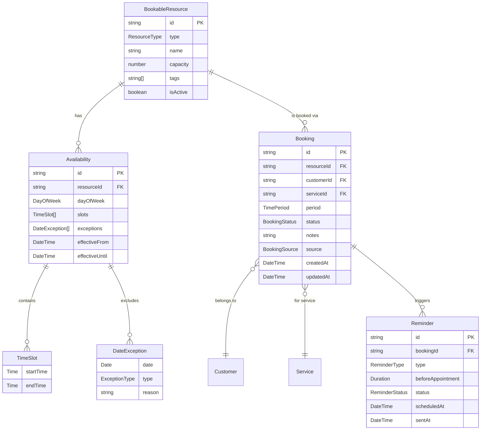

# 📅 Domain Model: Universal Scheduling Engine

> `@freshmanna/domain-scheduling` — The core booking engine that powers all appointment-based products.

## 🎯 Purpose

A generic, framework-agnostic scheduling library that treats ALL business resources as "bookable resources." This single library powers:
- **Capy-Salon**: Stylist time slots (30min-2hr)
- **Capy-Clinic**: Doctor/vet appointments (15min-1hr)
- **Capy-Hotel**: Room-nights (1+ days)
- **Capy-Restaurant**: Table reservations (1-2hr)
- **Capy-Business**: Team member hours (billable time)

---

## 🧬 Core Insight

Every service business performs the same fundamental operation:

> **Book a RESOURCE for a CUSTOMER over a TIME PERIOD**

The only differences are:
- What the "resource" is (person, room, table)
- How long the booking lasts (minutes, hours, days)
- What metadata is attached (service type, notes, medical records)

---

## 📐 Entity Diagram



---

## 🏗️ Entities

### BookableResource

The central abstraction — anything that can be booked.

```typescript
// @freshmanna/domain-scheduling/entities/bookable-resource.entity.ts

import { BaseEntity } from '@freshmanna/domain-core';

export enum ResourceType {
  TIME_SLOT = 'time-slot',      // Salon: stylist, Clinic: doctor
  ROOM = 'room',                // Hotel: room
  TABLE = 'table',              // Restaurant: table
  STAFF_HOURS = 'staff-hours',  // Business: team member
}

export interface BookableResourceProps {
  id: string;
  type: ResourceType;
  name: string;                  // "Maria - Chair 1", "Room 204", "Table 5"
  capacity: number;              // 1 for stylist, 2 for double room, 4 for table
  tags: string[];                // ["senior-stylist", "color-specialist"]
  isActive: boolean;
  metadata?: Record<string, unknown>; // Vertical-specific data
}

export class BookableResource extends BaseEntity<BookableResourceProps> {
  get type(): ResourceType { return this.props.type; }
  get name(): string { return this.props.name; }
  get capacity(): number { return this.props.capacity; }
  get tags(): string[] { return this.props.tags; }
  get isActive(): boolean { return this.props.isActive; }

  canAccommodate(partySize: number): boolean {
    return this.capacity >= partySize;
  }

  hasTag(tag: string): boolean {
    return this.tags.includes(tag);
  }

  deactivate(): BookableResource {
    return new BookableResource({ ...this.props, isActive: false });
  }

  activate(): BookableResource {
    return new BookableResource({ ...this.props, isActive: true });
  }
}
```

### Booking

A confirmed reservation of a resource for a customer.

```typescript
// @freshmanna/domain-scheduling/entities/booking.entity.ts

import { BaseEntity } from '@freshmanna/domain-core';
import { TimePeriod } from '../value-objects/time-period.value-object';

export enum BookingStatus {
  PENDING = 'pending',           // Awaiting confirmation
  CONFIRMED = 'confirmed',      // Confirmed by business
  IN_PROGRESS = 'in-progress',  // Currently happening
  COMPLETED = 'completed',      // Finished successfully
  CANCELLED = 'cancelled',      // Cancelled by customer or business
  NO_SHOW = 'no-show',          // Customer didn't show up
  RESCHEDULED = 'rescheduled',  // Moved to different time
}

export enum BookingSource {
  WALK_IN = 'walk-in',          // In-person booking
  ONLINE = 'online',            // Customer self-service
  PHONE = 'phone',              // Phone booking
  APP = 'app',                  // Mobile app
  CHANNEL = 'channel',          // External channel (Booking.com, etc.)
}

export interface BookingProps {
  id: string;
  resourceId: string;
  customerId: string;
  serviceId?: string;            // Optional — hotels don't always have a "service"
  period: TimePeriod;
  status: BookingStatus;
  notes?: string;
  source: BookingSource;
  partySize: number;             // 1 for salon, 2 for hotel double, 4 for restaurant
  createdAt: Date;
  updatedAt: Date;
  cancelledAt?: Date;
  cancellationReason?: string;
  metadata?: Record<string, unknown>;
}

export class Booking extends BaseEntity<BookingProps> {
  get resourceId(): string { return this.props.resourceId; }
  get customerId(): string { return this.props.customerId; }
  get serviceId(): string | undefined { return this.props.serviceId; }
  get period(): TimePeriod { return this.props.period; }
  get status(): BookingStatus { return this.props.status; }
  get source(): BookingSource { return this.props.source; }
  get partySize(): number { return this.props.partySize; }
  get notes(): string | undefined { return this.props.notes; }

  isActive(): boolean {
    return [BookingStatus.PENDING, BookingStatus.CONFIRMED, BookingStatus.IN_PROGRESS]
      .includes(this.status);
  }

  canCancel(): boolean {
    return [BookingStatus.PENDING, BookingStatus.CONFIRMED].includes(this.status);
  }

  canReschedule(): boolean {
    return [BookingStatus.PENDING, BookingStatus.CONFIRMED].includes(this.status);
  }

  confirm(): Booking {
    if (this.status !== BookingStatus.PENDING) {
      throw new Error(`Cannot confirm booking in status: ${this.status}`);
    }
    return new Booking({ ...this.props, status: BookingStatus.CONFIRMED, updatedAt: new Date() });
  }

  cancel(reason?: string): Booking {
    if (!this.canCancel()) {
      throw new Error(`Cannot cancel booking in status: ${this.status}`);
    }
    return new Booking({
      ...this.props,
      status: BookingStatus.CANCELLED,
      cancelledAt: new Date(),
      cancellationReason: reason,
      updatedAt: new Date(),
    });
  }

  markNoShow(): Booking {
    return new Booking({ ...this.props, status: BookingStatus.NO_SHOW, updatedAt: new Date() });
  }

  startService(): Booking {
    if (this.status !== BookingStatus.CONFIRMED) {
      throw new Error(`Cannot start service for booking in status: ${this.status}`);
    }
    return new Booking({ ...this.props, status: BookingStatus.IN_PROGRESS, updatedAt: new Date() });
  }

  complete(): Booking {
    if (this.status !== BookingStatus.IN_PROGRESS) {
      throw new Error(`Cannot complete booking in status: ${this.status}`);
    }
    return new Booking({ ...this.props, status: BookingStatus.COMPLETED, updatedAt: new Date() });
  }

  reschedule(newPeriod: TimePeriod): Booking {
    if (!this.canReschedule()) {
      throw new Error(`Cannot reschedule booking in status: ${this.status}`);
    }
    return new Booking({ ...this.props, period: newPeriod, status: BookingStatus.CONFIRMED, updatedAt: new Date() });
  }

  overlaps(other: Booking): boolean {
    return this.resourceId === other.resourceId && this.period.overlaps(other.period);
  }
}
```

### Availability

Defines when a resource is available for booking.

```typescript
// @freshmanna/domain-scheduling/entities/availability.entity.ts

import { BaseEntity } from '@freshmanna/domain-core';
import { TimeSlot } from '../value-objects/time-slot.value-object';
import { DateException, ExceptionType } from '../value-objects/date-exception.value-object';

export enum DayOfWeek {
  MONDAY = 1,
  TUESDAY = 2,
  WEDNESDAY = 3,
  THURSDAY = 4,
  FRIDAY = 5,
  SATURDAY = 6,
  SUNDAY = 7,
}

export interface AvailabilityProps {
  id: string;
  resourceId: string;
  dayOfWeek: DayOfWeek;
  slots: TimeSlot[];
  exceptions: DateException[];
  effectiveFrom?: Date;
  effectiveUntil?: Date;
}

export class Availability extends BaseEntity<AvailabilityProps> {
  get resourceId(): string { return this.props.resourceId; }
  get dayOfWeek(): DayOfWeek { return this.props.dayOfWeek; }
  get slots(): TimeSlot[] { return this.props.slots; }
  get exceptions(): DateException[] { return this.props.exceptions; }

  isAvailableOn(date: Date): boolean {
    // Check if date matches day of week
    const dateDayOfWeek = date.getDay() === 0 ? 7 : date.getDay();
    if (dateDayOfWeek !== this.dayOfWeek) return false;

    // Check exceptions (holidays, sick days, etc.)
    const exception = this.exceptions.find(e => this.isSameDate(e.date, date));
    if (exception && exception.type === ExceptionType.UNAVAILABLE) return false;

    // Check effective range
    if (this.props.effectiveFrom && date < this.props.effectiveFrom) return false;
    if (this.props.effectiveUntil && date > this.props.effectiveUntil) return false;

    return true;
  }

  getAvailableSlots(date: Date): TimeSlot[] {
    if (!this.isAvailableOn(date)) return [];

    // Check for modified hours on this date
    const exception = this.exceptions.find(
      e => this.isSameDate(e.date, date) && e.type === ExceptionType.MODIFIED_HOURS
    );

    if (exception && exception.modifiedSlots) {
      return exception.modifiedSlots;
    }

    return this.slots;
  }

  private isSameDate(a: Date, b: Date): boolean {
    return a.getFullYear() === b.getFullYear()
      && a.getMonth() === b.getMonth()
      && a.getDate() === b.getDate();
  }
}
```

---

## 💎 Value Objects

### TimePeriod

```typescript
// @freshmanna/domain-scheduling/value-objects/time-period.value-object.ts

import { BaseValueObject } from '@freshmanna/domain-core';

export interface TimePeriodProps {
  start: Date;
  end: Date;
}

export class TimePeriod extends BaseValueObject<TimePeriodProps> {
  get start(): Date { return this.props.start; }
  get end(): Date { return this.props.end; }

  static create(start: Date, end: Date): TimePeriod {
    if (end <= start) {
      throw new Error('End time must be after start time');
    }
    return new TimePeriod({ start, end });
  }

  get durationMinutes(): number {
    return (this.end.getTime() - this.start.getTime()) / (1000 * 60);
  }

  get durationHours(): number {
    return this.durationMinutes / 60;
  }

  get durationDays(): number {
    return Math.ceil(this.durationHours / 24);
  }

  overlaps(other: TimePeriod): boolean {
    return this.start < other.end && this.end > other.start;
  }

  contains(date: Date): boolean {
    return date >= this.start && date <= this.end;
  }

  adjacentTo(other: TimePeriod): boolean {
    return this.end.getTime() === other.start.getTime()
      || other.end.getTime() === this.start.getTime();
  }
}
```

### TimeSlot

```typescript
// @freshmanna/domain-scheduling/value-objects/time-slot.value-object.ts

import { BaseValueObject } from '@freshmanna/domain-core';

export interface TimeSlotProps {
  startHour: number;    // 0-23
  startMinute: number;  // 0-59
  endHour: number;      // 0-23
  endMinute: number;    // 0-59
}

export class TimeSlot extends BaseValueObject<TimeSlotProps> {
  get startHour(): number { return this.props.startHour; }
  get startMinute(): number { return this.props.startMinute; }
  get endHour(): number { return this.props.endHour; }
  get endMinute(): number { return this.props.endMinute; }

  static create(startHour: number, startMinute: number, endHour: number, endMinute: number): TimeSlot {
    if (startHour * 60 + startMinute >= endHour * 60 + endMinute) {
      throw new Error('End time must be after start time');
    }
    return new TimeSlot({ startHour, startMinute, endHour, endMinute });
  }

  get durationMinutes(): number {
    return (this.endHour * 60 + this.endMinute) - (this.startHour * 60 + this.startMinute);
  }

  containsTime(hour: number, minute: number): boolean {
    const timeInMinutes = hour * 60 + minute;
    const startInMinutes = this.startHour * 60 + this.startMinute;
    const endInMinutes = this.endHour * 60 + this.endMinute;
    return timeInMinutes >= startInMinutes && timeInMinutes < endInMinutes;
  }

  canFitDuration(durationMinutes: number, startHour: number, startMinute: number): boolean {
    const requestedStart = startHour * 60 + startMinute;
    const requestedEnd = requestedStart + durationMinutes;
    const slotStart = this.startHour * 60 + this.startMinute;
    const slotEnd = this.endHour * 60 + this.endMinute;
    return requestedStart >= slotStart && requestedEnd <= slotEnd;
  }

  toString(): string {
    const pad = (n: number) => n.toString().padStart(2, '0');
    return `${pad(this.startHour)}:${pad(this.startMinute)}-${pad(this.endHour)}:${pad(this.endMinute)}`;
  }
}
```

### Duration

```typescript
// @freshmanna/domain-scheduling/value-objects/duration.value-object.ts

import { BaseValueObject } from '@freshmanna/domain-core';

export interface DurationProps {
  minutes: number;
}

export class Duration extends BaseValueObject<DurationProps> {
  get minutes(): number { return this.props.minutes; }
  get hours(): number { return this.minutes / 60; }

  static fromMinutes(minutes: number): Duration {
    if (minutes <= 0) throw new Error('Duration must be positive');
    return new Duration({ minutes });
  }

  static fromHours(hours: number): Duration {
    return Duration.fromMinutes(hours * 60);
  }

  static fromDays(days: number): Duration {
    return Duration.fromMinutes(days * 24 * 60);
  }

  add(other: Duration): Duration {
    return Duration.fromMinutes(this.minutes + other.minutes);
  }

  toString(): string {
    if (this.minutes < 60) return `${this.minutes}min`;
    const h = Math.floor(this.minutes / 60);
    const m = this.minutes % 60;
    return m > 0 ? `${h}h ${m}min` : `${h}h`;
  }
}
```

### DateException

```typescript
// @freshmanna/domain-scheduling/value-objects/date-exception.value-object.ts

import { BaseValueObject } from '@freshmanna/domain-core';
import { TimeSlot } from './time-slot.value-object';

export enum ExceptionType {
  UNAVAILABLE = 'unavailable',       // Holiday, sick day, vacation
  MODIFIED_HOURS = 'modified-hours', // Different hours on this day
}

export interface DateExceptionProps {
  date: Date;
  type: ExceptionType;
  reason?: string;
  modifiedSlots?: TimeSlot[];  // Only for MODIFIED_HOURS
}

export class DateException extends BaseValueObject<DateExceptionProps> {
  get date(): Date { return this.props.date; }
  get type(): ExceptionType { return this.props.type; }
  get reason(): string | undefined { return this.props.reason; }
  get modifiedSlots(): TimeSlot[] | undefined { return this.props.modifiedSlots; }
}
```

---

## 🔌 Repository Interfaces

```typescript
// @freshmanna/domain-scheduling/interfaces/booking.repository.interface.ts

import { Booking, BookingStatus } from '../entities/booking.entity';
import { TimePeriod } from '../value-objects/time-period.value-object';

export interface IBookingRepository {
  findById(id: string): Promise<Booking | null>;
  findByResource(resourceId: string, period: TimePeriod): Promise<Booking[]>;
  findByCustomer(customerId: string, options?: { status?: BookingStatus[]; limit?: number }): Promise<Booking[]>;
  findByDateRange(start: Date, end: Date, options?: { resourceId?: string; status?: BookingStatus[] }): Promise<Booking[]>;
  findConflicting(resourceId: string, period: TimePeriod, excludeBookingId?: string): Promise<Booking[]>;
  save(booking: Booking): Promise<Booking>;
  delete(id: string): Promise<void>;
  countByStatus(resourceId: string, status: BookingStatus, period: TimePeriod): Promise<number>;
}

// @freshmanna/domain-scheduling/interfaces/resource.repository.interface.ts

import { BookableResource, ResourceType } from '../entities/bookable-resource.entity';

export interface IResourceRepository {
  findById(id: string): Promise<BookableResource | null>;
  findByType(type: ResourceType): Promise<BookableResource[]>;
  findActive(): Promise<BookableResource[]>;
  findByTag(tag: string): Promise<BookableResource[]>;
  save(resource: BookableResource): Promise<BookableResource>;
  delete(id: string): Promise<void>;
}

// @freshmanna/domain-scheduling/interfaces/availability.repository.interface.ts

import { Availability, DayOfWeek } from '../entities/availability.entity';

export interface IAvailabilityRepository {
  findByResource(resourceId: string): Promise<Availability[]>;
  findByResourceAndDay(resourceId: string, dayOfWeek: DayOfWeek): Promise<Availability | null>;
  save(availability: Availability): Promise<Availability>;
  saveMany(availabilities: Availability[]): Promise<Availability[]>;
  deleteByResource(resourceId: string): Promise<void>;
}
```

---

## 🎯 Domain Service: Slot Finder

The core scheduling logic — finds available time slots.

```typescript
// @freshmanna/domain-scheduling/services/slot-finder.service.ts

import { BookableResource } from '../entities/bookable-resource.entity';
import { Booking } from '../entities/booking.entity';
import { Availability } from '../entities/availability.entity';
import { Duration } from '../value-objects/duration.value-object';
import { TimeSlot } from '../value-objects/time-slot.value-object';
import { TimePeriod } from '../value-objects/time-period.value-object';

export interface AvailableSlot {
  resource: BookableResource;
  date: Date;
  startTime: TimeSlot;
  period: TimePeriod;
}

export interface FindSlotsQuery {
  resourceId?: string;           // Specific resource, or search all
  resourceType?: string;         // Filter by type
  date: Date;                    // Date to search
  duration: Duration;            // How long the booking needs
  partySize?: number;            // For capacity check (tables, rooms)
  tags?: string[];               // Filter resources by tags
}

export class SlotFinderService {

  findAvailableSlots(
    query: FindSlotsQuery,
    resources: BookableResource[],
    availabilities: Availability[],
    existingBookings: Booking[],
  ): AvailableSlot[] {
    const results: AvailableSlot[] = [];

    // Filter resources
    let candidateResources = resources.filter(r => r.isActive);
    if (query.resourceId) {
      candidateResources = candidateResources.filter(r => r.id === query.resourceId);
    }
    if (query.partySize) {
      candidateResources = candidateResources.filter(r => r.canAccommodate(query.partySize!));
    }
    if (query.tags?.length) {
      candidateResources = candidateResources.filter(r =>
        query.tags!.every(tag => r.hasTag(tag))
      );
    }

    for (const resource of candidateResources) {
      // Get availability for this resource on the requested day
      const dayOfWeek = query.date.getDay() === 0 ? 7 : query.date.getDay();
      const availability = availabilities.find(
        a => a.resourceId === resource.id && a.dayOfWeek === dayOfWeek
      );

      if (!availability || !availability.isAvailableOn(query.date)) continue;

      const slots = availability.getAvailableSlots(query.date);
      const resourceBookings = existingBookings.filter(
        b => b.resourceId === resource.id && b.isActive()
      );

      // For each available slot, find open windows
      for (const slot of slots) {
        const openWindows = this.findOpenWindows(
          query.date, slot, query.duration, resourceBookings
        );

        for (const window of openWindows) {
          results.push({
            resource,
            date: query.date,
            startTime: slot,
            period: window,
          });
        }
      }
    }

    return results.sort((a, b) => a.period.start.getTime() - b.period.start.getTime());
  }

  private findOpenWindows(
    date: Date,
    slot: TimeSlot,
    duration: Duration,
    bookings: Booking[],
  ): TimePeriod[] {
    const windows: TimePeriod[] = [];
    const slotStartMinutes = slot.startHour * 60 + slot.startMinute;
    const slotEndMinutes = slot.endHour * 60 + slot.endMinute;
    const step = 15; // 15-minute increments

    for (let startMin = slotStartMinutes; startMin + duration.minutes <= slotEndMinutes; startMin += step) {
      const startDate = new Date(date);
      startDate.setHours(Math.floor(startMin / 60), startMin % 60, 0, 0);

      const endDate = new Date(date);
      const endMin = startMin + duration.minutes;
      endDate.setHours(Math.floor(endMin / 60), endMin % 60, 0, 0);

      const candidatePeriod = TimePeriod.create(startDate, endDate);

      // Check for conflicts with existing bookings
      const hasConflict = bookings.some(b => b.period.overlaps(candidatePeriod));

      if (!hasConflict) {
        windows.push(candidatePeriod);
      }
    }

    return windows;
  }
}
```

---

## 📋 Use Cases

### CreateBooking

```typescript
// @freshmanna/app-booking/use-cases/create-booking.use-case.ts

export interface CreateBookingCommand {
  resourceId: string;
  customerId: string;
  serviceId?: string;
  startTime: Date;
  endTime: Date;
  notes?: string;
  source: BookingSource;
  partySize?: number;
}

export class CreateBookingUseCase {
  constructor(
    private bookingRepo: IBookingRepository,
    private resourceRepo: IResourceRepository,
    private slotFinder: SlotFinderService,
  ) {}

  async execute(command: CreateBookingCommand): Promise<Booking> {
    // 1. Validate resource exists and is active
    const resource = await this.resourceRepo.findById(command.resourceId);
    if (!resource || !resource.isActive) {
      throw new Error('Resource not found or inactive');
    }

    // 2. Check capacity
    if (command.partySize && !resource.canAccommodate(command.partySize)) {
      throw new Error(`Resource cannot accommodate party of ${command.partySize}`);
    }

    // 3. Check for conflicts
    const period = TimePeriod.create(command.startTime, command.endTime);
    const conflicts = await this.bookingRepo.findConflicting(command.resourceId, period);
    if (conflicts.length > 0) {
      throw new Error('Time slot is already booked');
    }

    // 4. Create booking
    const booking = new Booking({
      id: generateId(),
      resourceId: command.resourceId,
      customerId: command.customerId,
      serviceId: command.serviceId,
      period,
      status: BookingStatus.CONFIRMED,
      source: command.source,
      partySize: command.partySize ?? 1,
      notes: command.notes,
      createdAt: new Date(),
      updatedAt: new Date(),
    });

    // 5. Persist
    return this.bookingRepo.save(booking);
  }
}
```

### CheckAvailability

```typescript
// @freshmanna/app-booking/use-cases/check-availability.use-case.ts

export interface CheckAvailabilityQuery {
  date: Date;
  duration: Duration;
  resourceId?: string;
  resourceType?: ResourceType;
  partySize?: number;
  tags?: string[];
}

export class CheckAvailabilityUseCase {
  constructor(
    private resourceRepo: IResourceRepository,
    private availabilityRepo: IAvailabilityRepository,
    private bookingRepo: IBookingRepository,
    private slotFinder: SlotFinderService,
  ) {}

  async execute(query: CheckAvailabilityQuery): Promise<AvailableSlot[]> {
    // 1. Get candidate resources
    const resources = query.resourceId
      ? [await this.resourceRepo.findById(query.resourceId)].filter(Boolean)
      : await this.resourceRepo.findActive();

    // 2. Get availabilities for the day
    const dayOfWeek = query.date.getDay() === 0 ? 7 : query.date.getDay();
    const availabilities: Availability[] = [];
    for (const resource of resources) {
      const avail = await this.availabilityRepo.findByResourceAndDay(resource!.id, dayOfWeek);
      if (avail) availabilities.push(avail);
    }

    // 3. Get existing bookings for the day
    const dayStart = new Date(query.date);
    dayStart.setHours(0, 0, 0, 0);
    const dayEnd = new Date(query.date);
    dayEnd.setHours(23, 59, 59, 999);
    const bookings = await this.bookingRepo.findByDateRange(dayStart, dayEnd);

    // 4. Find available slots
    return this.slotFinder.findAvailableSlots(
      { ...query, date: query.date },
      resources as BookableResource[],
      availabilities,
      bookings,
    );
  }
}
```

### CancelBooking / RescheduleBooking

```typescript
// @freshmanna/app-booking/use-cases/cancel-booking.use-case.ts

export class CancelBookingUseCase {
  constructor(private bookingRepo: IBookingRepository) {}

  async execute(bookingId: string, reason?: string): Promise<Booking> {
    const booking = await this.bookingRepo.findById(bookingId);
    if (!booking) throw new Error('Booking not found');

    const cancelled = booking.cancel(reason);
    return this.bookingRepo.save(cancelled);
  }
}

// @freshmanna/app-booking/use-cases/reschedule-booking.use-case.ts

export class RescheduleBookingUseCase {
  constructor(private bookingRepo: IBookingRepository) {}

  async execute(bookingId: string, newStart: Date, newEnd: Date): Promise<Booking> {
    const booking = await this.bookingRepo.findById(bookingId);
    if (!booking) throw new Error('Booking not found');

    const newPeriod = TimePeriod.create(newStart, newEnd);

    // Check for conflicts at new time
    const conflicts = await this.bookingRepo.findConflicting(
      booking.resourceId, newPeriod, bookingId
    );
    if (conflicts.length > 0) {
      throw new Error('New time slot is already booked');
    }

    const rescheduled = booking.reschedule(newPeriod);
    return this.bookingRepo.save(rescheduled);
  }
}
```

---

## 🔧 Vertical Configuration Examples

### Salon Configuration
```typescript
const salonResource: BookableResourceProps = {
  id: 'stylist-maria-chair-1',
  type: ResourceType.TIME_SLOT,
  name: 'Maria - Chair 1',
  capacity: 1,
  tags: ['senior-stylist', 'color-specialist', 'bridal'],
  isActive: true,
  metadata: { specialties: ['balayage', 'keratin'] },
};
```

### Hotel Configuration
```typescript
const hotelResource: BookableResourceProps = {
  id: 'room-204-double',
  type: ResourceType.ROOM,
  name: 'Room 204 - Double Deluxe',
  capacity: 2,
  tags: ['double', 'sea-view', 'floor-2'],
  isActive: true,
  metadata: { floor: 2, amenities: ['wifi', 'minibar', 'balcony'], ratePerNight: 89.99 },
};
```

### Restaurant Configuration
```typescript
const restaurantResource: BookableResourceProps = {
  id: 'table-5-window',
  type: ResourceType.TABLE,
  name: 'Table 5 - Window',
  capacity: 4,
  tags: ['window', 'romantic', 'indoor'],
  isActive: true,
  metadata: { section: 'main-dining', shape: 'round' },
};
```

### Vet/Clinic Configuration
```typescript
const clinicResource: BookableResourceProps = {
  id: 'dr-garcia-room-a',
  type: ResourceType.TIME_SLOT,
  name: 'Dr. García - Consultation Room A',
  capacity: 1,
  tags: ['general-practice', 'surgery', 'emergency'],
  isActive: true,
  metadata: { specialization: 'small-animals', licenseNumber: 'VET-2024-001' },
};
```

---

## 📁 Library File Structure

```
libs/domain/scheduling/
├── src/
│   ├── entities/
│   │   ├── bookable-resource.entity.ts
│   │   ├── bookable-resource.entity.spec.ts
│   │   ├── booking.entity.ts
│   │   ├── booking.entity.spec.ts
│   │   ├── availability.entity.ts
│   │   ├── availability.entity.spec.ts
│   │   └── reminder.entity.ts
│   ├── value-objects/
│   │   ├── time-period.value-object.ts
│   │   ├── time-period.value-object.spec.ts
│   │   ├── time-slot.value-object.ts
│   │   ├── time-slot.value-object.spec.ts
│   │   ├── duration.value-object.ts
│   │   ├── duration.value-object.spec.ts
│   │   └── date-exception.value-object.ts
│   ├── interfaces/
│   │   ├── booking.repository.interface.ts
│   │   ├── resource.repository.interface.ts
│   │   └── availability.repository.interface.ts
│   ├── services/
│   │   ├── slot-finder.service.ts
│   │   └── slot-finder.service.spec.ts
│   └── index.ts                    # Barrel export
├── project.json
├── tsconfig.json
├── tsconfig.spec.json
└── README.md
```

---

*Last updated: 2026-06-14*
*Version: 1.0*
