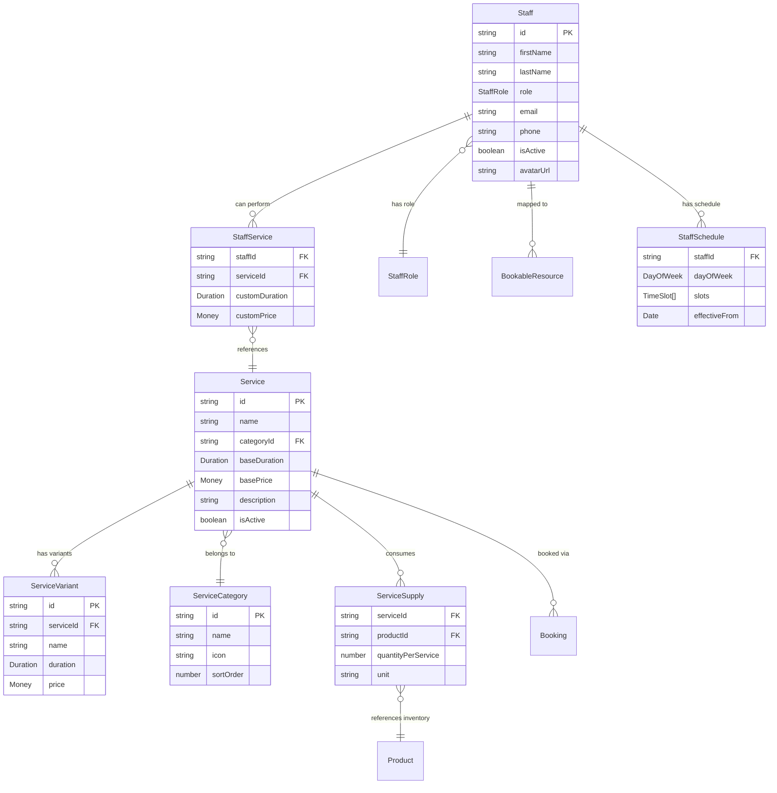

# 🛠️ Domain Model: Services & Staff

> `@freshmanna/domain-services` + `@freshmanna/domain-staff` — Time-based service catalog and staff/provider management.

## 🎯 Purpose

Two complementary domain libraries that model **what** a business offers (services) and **who** delivers them (staff). These connect directly to `@freshmanna/domain-scheduling` (bookings), `@freshmanna/domain-inventory` (supplies consumed), and `@freshmanna/domain-payments` (billing).

---

## 🧬 Core Insight

Every service business sells **time + expertise**, not physical goods:

| Vertical | Service Example | Provider | Supplies Consumed | Duration |
|----------|----------------|----------|-------------------|----------|
| Salon | Balayage coloring | Stylist Maria | Color mix, foils, toner | 2h |
| Vet | Annual vaccination | Dr. García | Vaccine vial, syringe | 15min |
| Dentist | Root canal | Dr. López | Anesthetic, files, crown | 1.5h |
| Hotel | Spa massage | Therapist Ana | Massage oil, towels | 1h |
| Business | Strategy consultation | Consultant Carlos | — | 2h |

The pattern: **A SERVICE is performed by STAFF, consumes INVENTORY, takes TIME, and costs MONEY.**

---

## 📐 Entity Relationship Diagram



---

## 🏗️ Entities

### Service

A time-based offering that a business sells.

```typescript
// @freshmanna/domain-services/entities/service.entity.ts

import { BaseEntity } from '@freshmanna/domain-core';
import { Duration } from '@freshmanna/domain-scheduling';
import { Money } from '@freshmanna/domain-core';

export interface ServiceProps {
  id: string;
  name: string;
  categoryId: string;
  description?: string;
  baseDuration: Duration;
  basePrice: Money;
  isActive: boolean;
  requiresDeposit: boolean;
  depositAmount?: Money;
  bufferTimeBefore: Duration;   // Prep time before service
  bufferTimeAfter: Duration;    // Cleanup time after service
  maxConcurrent: number;        // How many can run simultaneously (1 for most)
  tags: string[];
  metadata?: Record<string, unknown>;
  createdAt: Date;
  updatedAt: Date;
}

export class Service extends BaseEntity<ServiceProps> {
  get name(): string { return this.props.name; }
  get categoryId(): string { return this.props.categoryId; }
  get description(): string | undefined { return this.props.description; }
  get baseDuration(): Duration { return this.props.baseDuration; }
  get basePrice(): Money { return this.props.basePrice; }
  get isActive(): boolean { return this.props.isActive; }
  get requiresDeposit(): boolean { return this.props.requiresDeposit; }
  get depositAmount(): Money | undefined { return this.props.depositAmount; }
  get bufferTimeBefore(): Duration { return this.props.bufferTimeBefore; }
  get bufferTimeAfter(): Duration { return this.props.bufferTimeAfter; }
  get tags(): string[] { return this.props.tags; }

  /**
   * Total time blocked on the calendar (buffer + service + buffer)
   */
  get totalBlockedDuration(): Duration {
    return this.bufferTimeBefore
      .add(this.baseDuration)
      .add(this.bufferTimeAfter);
  }

  canBePerformedBy(staffTags: string[]): boolean {
    // Service tags must be a subset of staff capabilities
    return this.tags.every(tag => staffTags.includes(tag));
  }

  deactivate(): Service {
    return new Service({ ...this.props, isActive: false, updatedAt: new Date() });
  }

  updatePrice(newPrice: Money): Service {
    return new Service({ ...this.props, basePrice: newPrice, updatedAt: new Date() });
  }

  updateDuration(newDuration: Duration): Service {
    return new Service({ ...this.props, baseDuration: newDuration, updatedAt: new Date() });
  }
}
```

### ServiceVariant

Different versions of the same service (e.g., "Men's Haircut" vs "Women's Haircut").

```typescript
// @freshmanna/domain-services/entities/service-variant.entity.ts

import { BaseEntity } from '@freshmanna/domain-core';
import { Duration } from '@freshmanna/domain-scheduling';
import { Money } from '@freshmanna/domain-core';

export interface ServiceVariantProps {
  id: string;
  serviceId: string;
  name: string;                  // "Short hair", "Long hair", "Extra long"
  duration: Duration;            // Override base duration
  price: Money;                  // Override base price
  description?: string;
  sortOrder: number;
  isActive: boolean;
}

export class ServiceVariant extends BaseEntity<ServiceVariantProps> {
  get serviceId(): string { return this.props.serviceId; }
  get name(): string { return this.props.name; }
  get duration(): Duration { return this.props.duration; }
  get price(): Money { return this.props.price; }
  get sortOrder(): number { return this.props.sortOrder; }
  get isActive(): boolean { return this.props.isActive; }
}
```

### ServiceCategory

Groups services for display and navigation.

```typescript
// @freshmanna/domain-services/entities/service-category.entity.ts

import { BaseEntity } from '@freshmanna/domain-core';

export interface ServiceCategoryProps {
  id: string;
  name: string;
  description?: string;
  icon?: string;                 // Emoji or icon name
  color?: string;                // Hex color for UI
  sortOrder: number;
  parentId?: string;             // For nested categories
  isActive: boolean;
}

export class ServiceCategory extends BaseEntity<ServiceCategoryProps> {
  get name(): string { return this.props.name; }
  get icon(): string | undefined { return this.props.icon; }
  get color(): string | undefined { return this.props.color; }
  get sortOrder(): number { return this.props.sortOrder; }
  get parentId(): string | undefined { return this.props.parentId; }
  get isActive(): boolean { return this.props.isActive; }

  isSubcategory(): boolean {
    return this.parentId !== undefined;
  }
}
```

### ServiceSupply

Links a service to inventory items it consumes.

```typescript
// @freshmanna/domain-services/entities/service-supply.entity.ts

import { BaseValueObject } from '@freshmanna/domain-core';

export interface ServiceSupplyProps {
  serviceId: string;
  productId: string;             // References @freshmanna/domain-products
  productName: string;           // Denormalized for display
  quantityPerService: number;    // How much is consumed per service
  unit: string;                  // "ml", "units", "grams"
  isOptional: boolean;           // Some supplies are optional add-ons
}

export class ServiceSupply extends BaseValueObject<ServiceSupplyProps> {
  get serviceId(): string { return this.props.serviceId; }
  get productId(): string { return this.props.productId; }
  get productName(): string { return this.props.productName; }
  get quantityPerService(): number { return this.props.quantityPerService; }
  get unit(): string { return this.props.unit; }
  get isOptional(): boolean { return this.props.isOptional; }

  /**
   * Calculate total supply needed for N services
   */
  calculateNeeded(serviceCount: number): number {
    return this.quantityPerService * serviceCount;
  }
}
```

---

## 👤 Staff Entity (`@freshmanna/domain-staff`)

### Staff

A person who provides services.

```typescript
// @freshmanna/domain-staff/entities/staff.entity.ts

import { BaseEntity } from '@freshmanna/domain-core';

export enum StaffRole {
  OWNER = 'owner',
  MANAGER = 'manager',
  SENIOR_PROVIDER = 'senior-provider',
  PROVIDER = 'provider',
  JUNIOR_PROVIDER = 'junior-provider',
  ASSISTANT = 'assistant',
  RECEPTIONIST = 'receptionist',
}

export enum EmploymentType {
  FULL_TIME = 'full-time',
  PART_TIME = 'part-time',
  CONTRACT = 'contract',
  FREELANCE = 'freelance',
}

export interface StaffProps {
  id: string;
  firstName: string;
  lastName: string;
  email?: string;
  phone?: string;
  role: StaffRole;
  employmentType: EmploymentType;
  title?: string;                // "Senior Stylist", "Dr.", "Lead Developer"
  bio?: string;
  avatarUrl?: string;
  tags: string[];                // Capabilities: ["color", "bridal", "extensions"]
  isActive: boolean;
  hireDate: Date;
  commissionRate?: number;       // 0.0 - 1.0 (e.g., 0.4 = 40% commission)
  hourlyRate?: number;           // For hourly employees
  metadata?: Record<string, unknown>;
  createdAt: Date;
  updatedAt: Date;
}

export class Staff extends BaseEntity<StaffProps> {
  get firstName(): string { return this.props.firstName; }
  get lastName(): string { return this.props.lastName; }
  get fullName(): string { return `${this.firstName} ${this.lastName}`; }
  get displayName(): string { return this.props.title ? `${this.props.title} ${this.lastName}` : this.fullName; }
  get email(): string | undefined { return this.props.email; }
  get phone(): string | undefined { return this.props.phone; }
  get role(): StaffRole { return this.props.role; }
  get employmentType(): EmploymentType { return this.props.employmentType; }
  get tags(): string[] { return this.props.tags; }
  get isActive(): boolean { return this.props.isActive; }
  get commissionRate(): number | undefined { return this.props.commissionRate; }

  hasCapability(capability: string): boolean {
    return this.tags.includes(capability);
  }

  hasAllCapabilities(capabilities: string[]): boolean {
    return capabilities.every(cap => this.tags.includes(cap));
  }

  canPerformService(serviceTags: string[]): boolean {
    return serviceTags.every(tag => this.tags.includes(tag));
  }

  isManager(): boolean {
    return [StaffRole.OWNER, StaffRole.MANAGER].includes(this.role);
  }

  calculateCommission(servicePrice: number): number {
    if (!this.commissionRate) return 0;
    return servicePrice * this.commissionRate;
  }

  deactivate(): Staff {
    return new Staff({ ...this.props, isActive: false, updatedAt: new Date() });
  }

  addCapability(tag: string): Staff {
    if (this.tags.includes(tag)) return this;
    return new Staff({ ...this.props, tags: [...this.tags, tag], updatedAt: new Date() });
  }

  removeCapability(tag: string): Staff {
    return new Staff({ ...this.props, tags: this.tags.filter(t => t !== tag), updatedAt: new Date() });
  }
}
```

### StaffService

Maps which staff can perform which services (with optional custom pricing/duration).

```typescript
// @freshmanna/domain-staff/entities/staff-service.entity.ts

import { BaseEntity } from '@freshmanna/domain-core';
import { Duration } from '@freshmanna/domain-scheduling';
import { Money } from '@freshmanna/domain-core';

export interface StaffServiceProps {
  id: string;
  staffId: string;
  serviceId: string;
  customDuration?: Duration;     // Staff-specific duration override
  customPrice?: Money;           // Staff-specific price override (senior = more expensive)
  isActive: boolean;
  proficiencyLevel: number;      // 1-5 (used for smart assignment)
}

export class StaffService extends BaseEntity<StaffServiceProps> {
  get staffId(): string { return this.props.staffId; }
  get serviceId(): string { return this.props.serviceId; }
  get customDuration(): Duration | undefined { return this.props.customDuration; }
  get customPrice(): Money | undefined { return this.props.customPrice; }
  get proficiencyLevel(): number { return this.props.proficiencyLevel; }
  get isActive(): boolean { return this.props.isActive; }

  /**
   * Get effective duration (custom or fall back to service base)
   */
  getEffectiveDuration(serviceBaseDuration: Duration): Duration {
    return this.customDuration ?? serviceBaseDuration;
  }

  /**
   * Get effective price (custom or fall back to service base)
   */
  getEffectivePrice(serviceBasePrice: Money): Money {
    return this.customPrice ?? serviceBasePrice;
  }
}
```

### StaffSchedule

Defines a staff member's working hours (connects to `@freshmanna/domain-scheduling` Availability).

```typescript
// @freshmanna/domain-staff/entities/staff-schedule.entity.ts

import { BaseEntity } from '@freshmanna/domain-core';
import { DayOfWeek, TimeSlot, DateException } from '@freshmanna/domain-scheduling';

export interface StaffScheduleProps {
  id: string;
  staffId: string;
  dayOfWeek: DayOfWeek;
  slots: TimeSlot[];             // Working hours for this day
  breakSlots: TimeSlot[];        // Lunch, breaks
  exceptions: DateException[];   // Vacations, sick days
  effectiveFrom: Date;
  effectiveUntil?: Date;
}

export class StaffSchedule extends BaseEntity<StaffScheduleProps> {
  get staffId(): string { return this.props.staffId; }
  get dayOfWeek(): DayOfWeek { return this.props.dayOfWeek; }
  get slots(): TimeSlot[] { return this.props.slots; }
  get breakSlots(): TimeSlot[] { return this.props.breakSlots; }
  get exceptions(): DateException[] { return this.props.exceptions; }

  /**
   * Get net working minutes (total hours minus breaks)
   */
  get netWorkingMinutes(): number {
    const totalMinutes = this.slots.reduce((sum, s) => sum + s.durationMinutes, 0);
    const breakMinutes = this.breakSlots.reduce((sum, s) => sum + s.durationMinutes, 0);
    return totalMinutes - breakMinutes;
  }

  /**
   * Check if staff is working on a specific date
   */
  isWorkingOn(date: Date): boolean {
    const dateDayOfWeek = date.getDay() === 0 ? 7 : date.getDay();
    if (dateDayOfWeek !== this.dayOfWeek) return false;

    // Check effective range
    if (date < this.props.effectiveFrom) return false;
    if (this.props.effectiveUntil && date > this.props.effectiveUntil) return false;

    // Check exceptions
    const exception = this.exceptions.find(e =>
      e.date.getFullYear() === date.getFullYear() &&
      e.date.getMonth() === date.getMonth() &&
      e.date.getDate() === date.getDate()
    );

    return !exception || exception.type !== 'unavailable';
  }

  /**
   * Convert to BookableResource Availability (bridge to scheduling domain)
   */
  toAvailability(): { dayOfWeek: DayOfWeek; slots: TimeSlot[]; exceptions: DateException[] } {
    // Subtract break slots from working slots to get bookable slots
    return {
      dayOfWeek: this.dayOfWeek,
      slots: this.getBookableSlots(),
      exceptions: this.exceptions,
    };
  }

  private getBookableSlots(): TimeSlot[] {
    // Simple implementation: return working slots minus breaks
    // A more sophisticated version would split slots around breaks
    return this.slots;
  }
}
```

---

## 💎 Value Objects

### ServicePricing

Encapsulates pricing logic for services.

```typescript
// @freshmanna/domain-services/value-objects/service-pricing.value-object.ts

import { BaseValueObject } from '@freshmanna/domain-core';
import { Money } from '@freshmanna/domain-core';

export enum PricingType {
  FIXED = 'fixed',               // Fixed price regardless of duration
  HOURLY = 'hourly',            // Price per hour
  TIERED = 'tiered',            // Different prices for different durations
  STARTING_AT = 'starting-at',  // Base price + add-ons
}

export interface ServicePricingProps {
  type: PricingType;
  basePrice: Money;
  hourlyRate?: Money;
  minimumCharge?: Money;
  tiers?: Array<{ maxMinutes: number; price: Money }>;
}

export class ServicePricing extends BaseValueObject<ServicePricingProps> {
  get type(): PricingType { return this.props.type; }
  get basePrice(): Money { return this.props.basePrice; }

  calculatePrice(durationMinutes: number): Money {
    switch (this.type) {
      case PricingType.FIXED:
        return this.basePrice;

      case PricingType.HOURLY:
        const hours = durationMinutes / 60;
        return this.props.hourlyRate!.multiply(hours);

      case PricingType.TIERED:
        const tier = this.props.tiers!
          .sort((a, b) => a.maxMinutes - b.maxMinutes)
          .find(t => durationMinutes <= t.maxMinutes);
        return tier?.price ?? this.basePrice;

      case PricingType.STARTING_AT:
        return this.basePrice; // Add-ons calculated separately

      default:
        return this.basePrice;
    }
  }
}
```

### Commission

Value object for staff commission calculation.

```typescript
// @freshmanna/domain-staff/value-objects/commission.value-object.ts

import { BaseValueObject } from '@freshmanna/domain-core';
import { Money } from '@freshmanna/domain-core';

export enum CommissionType {
  PERCENTAGE = 'percentage',     // % of service price
  FLAT = 'flat',                 // Fixed amount per service
  TIERED = 'tiered',            // % changes based on revenue thresholds
}

export interface CommissionProps {
  type: CommissionType;
  rate: number;                  // 0.0 - 1.0 for percentage, absolute for flat
  tiers?: Array<{ threshold: Money; rate: number }>;
}

export class Commission extends BaseValueObject<CommissionProps> {
  get type(): CommissionType { return this.props.type; }
  get rate(): number { return this.props.rate; }

  calculate(serviceRevenue: Money, totalMonthlyRevenue?: Money): Money {
    switch (this.type) {
      case CommissionType.PERCENTAGE:
        return serviceRevenue.multiply(this.rate);

      case CommissionType.FLAT:
        return new Money(this.rate, serviceRevenue.currency);

      case CommissionType.TIERED:
        if (!totalMonthlyRevenue || !this.props.tiers) {
          return serviceRevenue.multiply(this.rate);
        }
        const applicableTier = this.props.tiers
          .sort((a, b) => b.threshold.cents - a.threshold.cents)
          .find(t => totalMonthlyRevenue.greaterThan(t.threshold) || totalMonthlyRevenue.equals(t.threshold));
        const effectiveRate = applicableTier?.rate ?? this.rate;
        return serviceRevenue.multiply(effectiveRate);

      default:
        return serviceRevenue.multiply(this.rate);
    }
  }
}
```

---

## 🔌 Repository Interfaces

```typescript
// @freshmanna/domain-services/interfaces/service.repository.interface.ts

import { Service } from '../entities/service.entity';

export interface IServiceRepository {
  findById(id: string): Promise<Service | null>;
  findByCategory(categoryId: string): Promise<Service[]>;
  findActive(): Promise<Service[]>;
  findByTags(tags: string[]): Promise<Service[]>;
  search(query: string): Promise<Service[]>;
  save(service: Service): Promise<Service>;
  delete(id: string): Promise<void>;
}

// @freshmanna/domain-services/interfaces/service-category.repository.interface.ts

import { ServiceCategory } from '../entities/service-category.entity';

export interface IServiceCategoryRepository {
  findAll(): Promise<ServiceCategory[]>;
  findById(id: string): Promise<ServiceCategory | null>;
  findByParent(parentId: string): Promise<ServiceCategory[]>;
  save(category: ServiceCategory): Promise<ServiceCategory>;
  delete(id: string): Promise<void>;
  reorder(ids: string[]): Promise<void>;
}

// @freshmanna/domain-staff/interfaces/staff.repository.interface.ts

import { Staff, StaffRole } from '../entities/staff.entity';

export interface IStaffRepository {
  findById(id: string): Promise<Staff | null>;
  findActive(): Promise<Staff[]>;
  findByRole(role: StaffRole): Promise<Staff[]>;
  findByCapability(tag: string): Promise<Staff[]>;
  findWhoCanPerform(serviceId: string): Promise<Staff[]>;
  save(staff: Staff): Promise<Staff>;
  delete(id: string): Promise<void>;
}

// @freshmanna/domain-staff/interfaces/staff-schedule.repository.interface.ts

import { StaffSchedule } from '../entities/staff-schedule.entity';
import { DayOfWeek } from '@freshmanna/domain-scheduling';

export interface IStaffScheduleRepository {
  findByStaff(staffId: string): Promise<StaffSchedule[]>;
  findByStaffAndDay(staffId: string, dayOfWeek: DayOfWeek): Promise<StaffSchedule | null>;
  findByDate(date: Date): Promise<StaffSchedule[]>;
  save(schedule: StaffSchedule): Promise<StaffSchedule>;
  saveMany(schedules: StaffSchedule[]): Promise<StaffSchedule[]>;
  deleteByStaff(staffId: string): Promise<void>;
}

// @freshmanna/domain-staff/interfaces/staff-service.repository.interface.ts

import { StaffService } from '../entities/staff-service.entity';

export interface IStaffServiceRepository {
  findByStaff(staffId: string): Promise<StaffService[]>;
  findByService(serviceId: string): Promise<StaffService[]>;
  findByStaffAndService(staffId: string, serviceId: string): Promise<StaffService | null>;
  save(staffService: StaffService): Promise<StaffService>;
  delete(staffId: string, serviceId: string): Promise<void>;
}
```

---

## 🎯 Domain Services

### StaffAssignmentService

Finds the best staff member for a service booking.

```typescript
// @freshmanna/domain-staff/services/staff-assignment.service.ts

import { Staff } from '../entities/staff.entity';
import { StaffService } from '../entities/staff-service.entity';
import { StaffSchedule } from '../entities/staff-schedule.entity';
import { Booking } from '@freshmanna/domain-scheduling';
import { Duration } from '@freshmanna/domain-scheduling';

export interface AssignmentCriteria {
  serviceId: string;
  date: Date;
  duration: Duration;
  preferredStaffId?: string;     // Customer preference
  requiredTags?: string[];       // Must-have capabilities
}

export interface StaffCandidate {
  staff: Staff;
  staffService: StaffService;
  availableSlots: number;        // How many open slots they have
  proficiency: number;           // 1-5 skill level
  score: number;                 // Calculated assignment score
}

export class StaffAssignmentService {

  findBestStaff(
    criteria: AssignmentCriteria,
    allStaff: Staff[],
    staffServices: StaffService[],
    schedules: StaffSchedule[],
    existingBookings: Booking[],
  ): StaffCandidate[] {
    // 1. Filter staff who can perform this service
    const qualifiedStaffServices = staffServices.filter(
      ss => ss.serviceId === criteria.serviceId && ss.isActive
    );

    const candidates: StaffCandidate[] = [];

    for (const ss of qualifiedStaffServices) {
      const staff = allStaff.find(s => s.id === ss.staffId);
      if (!staff || !staff.isActive) continue;

      // 2. Check required tags
      if (criteria.requiredTags?.length) {
        if (!staff.hasAllCapabilities(criteria.requiredTags)) continue;
      }

      // 3. Check if staff is working on the requested date
      const dayOfWeek = criteria.date.getDay() === 0 ? 7 : criteria.date.getDay();
      const schedule = schedules.find(
        s => s.staffId === staff.id && s.dayOfWeek === dayOfWeek
      );
      if (!schedule || !schedule.isWorkingOn(criteria.date)) continue;

      // 4. Count available slots
      const staffBookings = existingBookings.filter(
        b => b.resourceId === staff.id && b.isActive()
      );
      const totalMinutes = schedule.netWorkingMinutes;
      const bookedMinutes = staffBookings.reduce(
        (sum, b) => sum + b.period.durationMinutes, 0
      );
      const availableMinutes = totalMinutes - bookedMinutes;
      const availableSlots = Math.floor(availableMinutes / criteria.duration.minutes);

      if (availableSlots <= 0) continue;

      // 5. Calculate score
      const score = this.calculateScore(staff, ss, availableSlots, criteria);

      candidates.push({
        staff,
        staffService: ss,
        availableSlots,
        proficiency: ss.proficiencyLevel,
        score,
      });
    }

    // Sort by score (highest first)
    return candidates.sort((a, b) => b.score - a.score);
  }

  private calculateScore(
    staff: Staff,
    staffService: StaffService,
    availableSlots: number,
    criteria: AssignmentCriteria,
  ): number {
    let score = 0;

    // Preferred staff gets highest priority
    if (criteria.preferredStaffId === staff.id) score += 100;

    // Proficiency level (1-5 → 10-50 points)
    score += staffService.proficiencyLevel * 10;

    // Load balancing: more available slots = higher score
    score += Math.min(availableSlots * 5, 25);

    // Seniority bonus
    if (staff.role === 'senior-provider') score += 10;

    return score;
  }
}
```

### ServiceCatalogService

Business logic for managing the service catalog.

```typescript
// @freshmanna/domain-services/services/service-catalog.service.ts

import { Service } from '../entities/service.entity';
import { ServiceCategory } from '../entities/service-category.entity';
import { ServiceSupply } from '../entities/service-supply.entity';

export interface CatalogEntry {
  service: Service;
  category: ServiceCategory;
  supplies: ServiceSupply[];
  availableStaffCount: number;
}

export class ServiceCatalogService {

  /**
   * Build a display-ready catalog grouped by category
   */
  buildCatalog(
    services: Service[],
    categories: ServiceCategory[],
    supplies: ServiceSupply[],
    staffCounts: Map<string, number>,
  ): Map<ServiceCategory, CatalogEntry[]> {
    const catalog = new Map<ServiceCategory, CatalogEntry[]>();

    // Sort categories by sortOrder
    const sortedCategories = [...categories]
      .filter(c => c.isActive)
      .sort((a, b) => a.sortOrder - b.sortOrder);

    for (const category of sortedCategories) {
      const categoryServices = services
        .filter(s => s.categoryId === category.id && s.isActive)
        .map(service => ({
          service,
          category,
          supplies: supplies.filter(sup => sup.serviceId === service.id),
          availableStaffCount: staffCounts.get(service.id) ?? 0,
        }));

      if (categoryServices.length > 0) {
        catalog.set(category, categoryServices);
      }
    }

    return catalog;
  }

  /**
   * Calculate supply requirements for a set of bookings
   */
  calculateSupplyNeeds(
    serviceIds: string[],
    supplies: ServiceSupply[],
  ): Map<string, { productId: string; productName: string; totalNeeded: number; unit: string }> {
    const needs = new Map<string, { productId: string; productName: string; totalNeeded: number; unit: string }>();

    for (const serviceId of serviceIds) {
      const serviceSupplies = supplies.filter(s => s.serviceId === serviceId);
      for (const supply of serviceSupplies) {
        const existing = needs.get(supply.productId);
        if (existing) {
          existing.totalNeeded += supply.quantityPerService;
        } else {
          needs.set(supply.productId, {
            productId: supply.productId,
            productName: supply.productName,
            totalNeeded: supply.quantityPerService,
            unit: supply.unit,
          });
        }
      }
    }

    return needs;
  }
}
```

---

## 📋 Use Cases

### CreateService

```typescript
// @freshmanna/app-staff-mgmt/use-cases/create-service.use-case.ts

export interface CreateServiceCommand {
  name: string;
  categoryId: string;
  description?: string;
  durationMinutes: number;
  price: number;
  currency?: string;
  bufferBeforeMinutes?: number;
  bufferAfterMinutes?: number;
  tags?: string[];
  requiresDeposit?: boolean;
  depositAmount?: number;
}

export class CreateServiceUseCase {
  constructor(
    private serviceRepo: IServiceRepository,
    private categoryRepo: IServiceCategoryRepository,
  ) {}

  async execute(command: CreateServiceCommand): Promise<Service> {
    // 1. Validate category exists
    const category = await this.categoryRepo.findById(command.categoryId);
    if (!category) throw new Error('Category not found');

    // 2. Create service
    const service = new Service({
      id: generateId(),
      name: command.name,
      categoryId: command.categoryId,
      description: command.description,
      baseDuration: Duration.fromMinutes(command.durationMinutes),
      basePrice: new Money(command.price, command.currency ?? 'USD'),
      isActive: true,
      requiresDeposit: command.requiresDeposit ?? false,
      depositAmount: command.depositAmount
        ? new Money(command.depositAmount, command.currency ?? 'USD')
        : undefined,
      bufferTimeBefore: Duration.fromMinutes(command.bufferBeforeMinutes ?? 0),
      bufferTimeAfter: Duration.fromMinutes(command.bufferAfterMinutes ?? 5),
      maxConcurrent: 1,
      tags: command.tags ?? [],
      createdAt: new Date(),
      updatedAt: new Date(),
    });

    return this.serviceRepo.save(service);
  }
}
```

### AssignStaffToService

```typescript
// @freshmanna/app-staff-mgmt/use-cases/assign-staff-to-service.use-case.ts

export interface AssignStaffCommand {
  staffId: string;
  serviceId: string;
  customDurationMinutes?: number;
  customPrice?: number;
  proficiencyLevel?: number;
}

export class AssignStaffToServiceUseCase {
  constructor(
    private staffRepo: IStaffRepository,
    private serviceRepo: IServiceRepository,
    private staffServiceRepo: IStaffServiceRepository,
  ) {}

  async execute(command: AssignStaffCommand): Promise<StaffService> {
    // 1. Validate staff exists
    const staff = await this.staffRepo.findById(command.staffId);
    if (!staff) throw new Error('Staff not found');

    // 2. Validate service exists
    const service = await this.serviceRepo.findById(command.serviceId);
    if (!service) throw new Error('Service not found');

    // 3. Check if already assigned
    const existing = await this.staffServiceRepo.findByStaffAndService(
      command.staffId, command.serviceId
    );
    if (existing) throw new Error('Staff already assigned to this service');

    // 4. Create assignment
    const staffService = new StaffService({
      id: generateId(),
      staffId: command.staffId,
      serviceId: command.serviceId,
      customDuration: command.customDurationMinutes
        ? Duration.fromMinutes(command.customDurationMinutes)
        : undefined,
      customPrice: command.customPrice
        ? new Money(command.customPrice)
        : undefined,
      isActive: true,
      proficiencyLevel: command.proficiencyLevel ?? 3,
    });

    return this.staffServiceRepo.save(staffService);
  }
}
```

### SetStaffSchedule

```typescript
// @freshmanna/app-staff-mgmt/use-cases/set-staff-schedule.use-case.ts

export interface SetScheduleCommand {
  staffId: string;
  schedule: Array<{
    dayOfWeek: DayOfWeek;
    startHour: number;
    startMinute: number;
    endHour: number;
    endMinute: number;
    breakStartHour?: number;
    breakStartMinute?: number;
    breakEndHour?: number;
    breakEndMinute?: number;
  }>;
  effectiveFrom: Date;
}

export class SetStaffScheduleUseCase {
  constructor(
    private staffRepo: IStaffRepository,
    private scheduleRepo: IStaffScheduleRepository,
  ) {}

  async execute(command: SetScheduleCommand): Promise<StaffSchedule[]> {
    // 1. Validate staff exists
    const staff = await this.staffRepo.findById(command.staffId);
    if (!staff) throw new Error('Staff not found');

    // 2. Build schedule entities
    const schedules = command.schedule.map(day => {
      const workSlot = TimeSlot.create(
        day.startHour, day.startMinute, day.endHour, day.endMinute
      );

      const breakSlots: TimeSlot[] = [];
      if (day.breakStartHour !== undefined && day.breakEndHour !== undefined) {
        breakSlots.push(TimeSlot.create(
          day.breakStartHour, day.breakStartMinute ?? 0,
          day.breakEndHour, day.breakEndMinute ?? 0,
        ));
      }

      return new StaffSchedule({
        id: generateId(),
        staffId: command.staffId,
        dayOfWeek: day.dayOfWeek,
        slots: [workSlot],
        breakSlots,
        exceptions: [],
        effectiveFrom: command.effectiveFrom,
      });
    });

    return this.scheduleRepo.saveMany(schedules);
  }
}
```

---

## 🔧 Vertical Configuration Examples

### Salon
```typescript
// Categories
const salonCategories: ServiceCategoryProps[] = [
  { id: 'cat-hair', name: 'Hair', icon: '💇', color: '#FF6B9D', sortOrder: 1, isActive: true },
  { id: 'cat-nails', name: 'Nails', icon: '💅', color: '#9B59B6', sortOrder: 2, isActive: true },
  { id: 'cat-skin', name: 'Skin Care', icon: '✨', color: '#3498DB', sortOrder: 3, isActive: true },
];

// Services
const salonServices: ServiceProps[] = [
  {
    id: 'svc-haircut-women',
    name: "Women's Haircut",
    categoryId: 'cat-hair',
    baseDuration: Duration.fromMinutes(45),
    basePrice: new Money(35),
    bufferTimeBefore: Duration.fromMinutes(5),
    bufferTimeAfter: Duration.fromMinutes(10),
    tags: ['haircut'],
    // ...
  },
  {
    id: 'svc-balayage',
    name: 'Balayage',
    categoryId: 'cat-hair',
    baseDuration: Duration.fromMinutes(120),
    basePrice: new Money(150),
    bufferTimeBefore: Duration.fromMinutes(5),
    bufferTimeAfter: Duration.fromMinutes(15),
    tags: ['color', 'balayage'],
    // ...
  },
];

// Staff
const salonStaff: StaffProps[] = [
  {
    id: 'staff-maria',
    firstName: 'Maria',
    lastName: 'González',
    role: StaffRole.SENIOR_PROVIDER,
    tags: ['haircut', 'color', 'balayage', 'bridal', 'extensions'],
    commissionRate: 0.45,
    // ...
  },
];
```

### Veterinary Clinic
```typescript
const vetCategories: ServiceCategoryProps[] = [
  { id: 'cat-consult', name: 'Consultations', icon: '🩺', sortOrder: 1, isActive: true },
  { id: 'cat-vaccine', name: 'Vaccinations', icon: '💉', sortOrder: 2, isActive: true },
  { id: 'cat-surgery', name: 'Surgery', icon: '🏥', sortOrder: 3, isActive: true },
  { id: 'cat-dental', name: 'Dental', icon: '🦷', sortOrder: 4, isActive: true },
];

const vetServices: ServiceProps[] = [
  {
    id: 'svc-general-consult',
    name: 'General Consultation',
    categoryId: 'cat-consult',
    baseDuration: Duration.fromMinutes(20),
    basePrice: new Money(45),
    bufferTimeBefore: Duration.fromMinutes(5),
    bufferTimeAfter: Duration.fromMinutes(5),
    tags: ['general-practice'],
    // ...
  },
  {
    id: 'svc-spay',
    name: 'Spay/Neuter Surgery',
    categoryId: 'cat-surgery',
    baseDuration: Duration.fromMinutes(60),
    basePrice: new Money(250),
    bufferTimeBefore: Duration.fromMinutes(15),
    bufferTimeAfter: Duration.fromMinutes(30),
    tags: ['surgery', 'anesthesia'],
    requiresDeposit: true,
    depositAmount: new Money(50),
    // ...
  },
];

// Supplies consumed per service
const vetSupplies: ServiceSupplyProps[] = [
  { serviceId: 'svc-general-consult', productId: 'prod-gloves', productName: 'Exam Gloves', quantityPerService: 2, unit: 'pairs', isOptional: false },
  { serviceId: 'svc-spay', productId: 'prod-anesthetic', productName: 'Isoflurane', quantityPerService: 15, unit: 'ml', isOptional: false },
  { serviceId: 'svc-spay', productId: 'prod-sutures', productName: 'Absorbable Sutures', quantityPerService: 1, unit: 'pack', isOptional: false },
];
```

---

## 🔗 Cross-Domain Integration Points

```
┌─────────────────────────────────────────────────────────────────┐
│                    HOW DOMAINS CONNECT                            │
└─────────────────────────────────────────────────────────────────┘

  domain-services ──────────────────────────────────────────────┐
       │                                                         │
       │ "Service X takes 45min"                                │
       ▼                                                         │
  domain-scheduling                                              │
       │                                                         │
       │ "Book Resource Y for 45min"                            │
       ▼                                                         │
  domain-staff ─── "Staff Z performs Service X" ────────────────┤
       │                                                         │
       │ "Staff Z is BookableResource Y"                        │
       ▼                                                         │
  domain-inventory                                               │
       │                                                         │
       │ "Service X consumes 2 units of Product P"              │
       ▼                                                         │
  domain-payments                                                │
       │                                                         │
       │ "Charge $45 for Service X"                             │
       ▼                                                         │
  domain-transactions ──── "Record sale" ───────────────────────┘
```

### Integration Flow (Booking a Salon Appointment):

1. **Customer selects service** → `domain-services` provides duration + price
2. **System finds available staff** → `domain-staff` + `domain-scheduling` find open slots
3. **Customer picks time** → `domain-scheduling` creates Booking
4. **Service begins** → `domain-inventory` deducts supplies consumed
5. **Service completes** → `domain-payments` processes payment
6. **Commission calculated** → `domain-staff` calculates staff earnings
7. **Transaction recorded** → `domain-transactions` logs the sale

---

## 📁 Library File Structures

### `@freshmanna/domain-services`
```
libs/domain/services/
├── src/
│   ├── entities/
│   │   ├── service.entity.ts
│   │   ├── service.entity.spec.ts
│   │   ├── service-variant.entity.ts
│   │   ├── service-variant.entity.spec.ts
│   │   ├── service-category.entity.ts
│   │   ├── service-category.entity.spec.ts
│   │   └── service-supply.entity.ts
│   ├── value-objects/
│   │   ├── service-pricing.value-object.ts
│   │   └── service-pricing.value-object.spec.ts
│   ├── interfaces/
│   │   ├── service.repository.interface.ts
│   │   └── service-category.repository.interface.ts
│   ├── services/
│   │   ├── service-catalog.service.ts
│   │   └── service-catalog.service.spec.ts
│   └── index.ts
├── project.json
├── tsconfig.json
└── README.md
```

### `@freshmanna/domain-staff`
```
libs/domain/staff/
├── src/
│   ├── entities/
│   │   ├── staff.entity.ts
│   │   ├── staff.entity.spec.ts
│   │   ├── staff-service.entity.ts
│   │   ├── staff-service.entity.spec.ts
│   │   ├── staff-schedule.entity.ts
│   │   └── staff-schedule.entity.spec.ts
│   ├── value-objects/
│   │   ├── commission.value-object.ts
│   │   └── commission.value-object.spec.ts
│   ├── interfaces/
│   │   ├── staff.repository.interface.ts
│   │   ├── staff-schedule.repository.interface.ts
│   │   └── staff-service.repository.interface.ts
│   ├── services/
│   │   ├── staff-assignment.service.ts
│   │   └── staff-assignment.service.spec.ts
│   └── index.ts
├── project.json
├── tsconfig.json
└── README.md
```

---

*Last updated: 2026-06-14*
*Version: 1.0*
