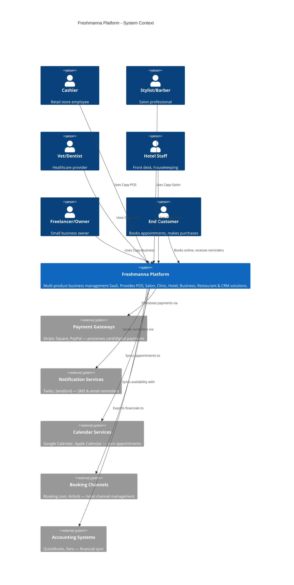

# 🌐 Freshmanna Ecosystem Plan

> **"Built for Business. Made for Humans."**

## 📋 Overview

Freshmanna is a multi-product SaaS platform that provides business management solutions across multiple verticals. Each product is a thin Angular application that composes shared libraries from an Nx monorepo under the `@freshmanna/*` npm scope.

The platform leverages a **universal booking engine** that treats all business resources (time slots, rooms, tables, staff hours) as "bookable resources" — enabling maximum code reuse across verticals.

---

## 🎯 Product Suite

| Product | Market | Tagline | Status |
|---------|--------|---------|--------|
| **Capy-POS** | Retail stores | "Sell smarter. Stock better." | ✅ Built |
| **Capy-Salon** | Barbers, nails, hair, spas | "Style meets Scheduling. Seamlessly." | 🔜 Next |
| **Capy-Clinic** | Dentists, veterinarians | "Efficient Care. Simplified Records." | Planned |
| **Capy-Hotel** | Small hotels, hostels, B&Bs | "Modern Hospitality. Seamless Booking." | Planned |
| **Capy-Business** | Freelancers, small companies | "Your Business. Simplified." | Planned |
| **Capy-Restaurant** | Restaurants, cafés | "Orders flowing. Kitchen glowing." | Planned |
| **Capy-CRM** | Cross-vertical | "Know your customers. Grow your business." | Planned |

---

## 🏛️ C4 System Context Diagram (Level 1)



### ASCII Representation

```
┌─────────────────────────────────────────────────────────────────────┐
│                            USERS (Personas)                          │
│                                                                      │
│  👤 Cashier    👤 Stylist    👤 Vet/Dentist    👤 Hotel Staff       │
│  👤 Freelancer    👤 End Customer (books online)                     │
└──────────────────────────────┬──────────────────────────────────────┘
                               │ Uses
                               ▼
┌─────────────────────────────────────────────────────────────────────┐
│                     FRESHMANNA PLATFORM                               │
│                                                                      │
│  ┌──────────┐ ┌──────────┐ ┌──────────┐ ┌──────────┐              │
│  │ Capy-POS │ │Capy-Salon│ │Capy-Clinic│ │Capy-Hotel│              │
│  └──────────┘ └──────────┘ └──────────┘ └──────────┘              │
│  ┌──────────────┐ ┌───────────────┐ ┌──────────┐                   │
│  │Capy-Business │ │Capy-Restaurant│ │ Capy-CRM │                   │
│  └──────────────┘ └───────────────┘ └──────────┘                   │
│                                                                      │
│  "Built for Business. Made for Humans."                              │
└──────────────────────────────┬──────────────────────────────────────┘
                               │ Integrates with
                               ▼
┌─────────────────────────────────────────────────────────────────────┐
│                       EXTERNAL SYSTEMS                                │
│                                                                      │
│  💳 Payment Gateways (Stripe, Square, PayPal)                       │
│  📱 Notification Services (Twilio, SendGrid)                         │
│  📅 Calendar Services (Google Calendar, Apple Calendar)              │
│  🏨 Booking Channels (Booking.com, Airbnb)                          │
│  📊 Accounting Systems (QuickBooks, Xero)                            │
└─────────────────────────────────────────────────────────────────────┘
```

---

## 📦 C4 Container Diagram (Level 2)

```mermaid
C4Container
    title Freshmanna Platform - Container Diagram

    Container_Boundary(apps, "Applications (Thin Angular Shells)") {
        Container(pos, "Capy-POS", "Angular 21+", "Retail point of sale")
        Container(salon, "Capy-Salon", "Angular 21+", "Appointment & service management")
        Container(clinic, "Capy-Clinic", "Angular 21+", "Patient records & scheduling")
        Container(hotel, "Capy-Hotel", "Angular 21+", "Room booking & guest management")
        Container(business, "Capy-Business", "Angular 21+", "Invoicing & project management")
        Container(restaurant, "Capy-Restaurant", "Angular 21+", "Menu, orders & kitchen display")
        Container(crm, "Capy-CRM", "Angular 21+", "Cross-vertical customer management")
    }

    Container_Boundary(ui_libs, "UI Libraries (@freshmanna/ui-*)") {
        Container(ui_shared, "ui-shared", "Angular", "Design system, layout, navigation")
        Container(ui_calendar, "ui-calendar", "Angular", "Calendar, time slots, booking widget")
        Container(ui_products, "ui-products", "Angular", "Product search, cards, lists")
        Container(ui_customers, "ui-customers", "Angular", "Customer forms, search, lists")
        Container(ui_checkout, "ui-checkout", "Angular", "Cart, totals, payment flow")
        Container(ui_reports, "ui-reports", "Angular", "Charts, summaries, dashboards")
        Container(ui_staff, "ui-staff", "Angular", "Staff schedule, availability grid")
    }

    Container_Boundary(app_libs, "Application Libraries (@freshmanna/app-*)") {
        Container(app_checkout, "app-checkout", "TypeScript", "Cart + payment use cases")
        Container(app_booking, "app-booking", "TypeScript", "Appointment booking engine")
        Container(app_inventory, "app-inventory", "TypeScript", "Stock management use cases")
        Container(app_customers, "app-customers", "TypeScript", "Customer CRUD use cases")
        Container(app_analytics, "app-analytics", "TypeScript", "Reports & dashboards")
        Container(app_staff, "app-staff-mgmt", "TypeScript", "Staff scheduling use cases")
    }

    Container_Boundary(infra_libs, "Infrastructure Libraries (@freshmanna/infra-*)") {
        Container(infra_dexie, "infra-dexie", "TypeScript", "Dexie/IndexedDB repositories")
        Container(infra_agents, "infra-agents", "TypeScript", "AI agent framework")
        Container(infra_notif, "infra-notifications", "TypeScript", "SMS/email/push providers")
    }

    Container_Boundary(domain_libs, "Domain Libraries (@freshmanna/domain-*) — PURE TypeScript") {
        Container(dom_core, "domain-core", "TypeScript", "Base entities, value objects, exceptions")
        Container(dom_scheduling, "domain-scheduling", "TypeScript", "Universal booking engine ⭐")
        Container(dom_customers, "domain-customers", "TypeScript", "Client/patient/guest entities")
        Container(dom_payments, "domain-payments", "TypeScript", "Payment processing")
        Container(dom_products, "domain-products", "TypeScript", "Physical inventory items")
        Container(dom_services, "domain-services", "TypeScript", "Time-based services")
        Container(dom_staff, "domain-staff", "TypeScript", "Providers, roles, schedules")
        Container(dom_inventory, "domain-inventory", "TypeScript", "Stock tracking")
        Container(dom_transactions, "domain-transactions", "TypeScript", "Transaction history")
        Container(dom_loyalty, "domain-loyalty", "TypeScript", "Points, rewards, tiers")
        Container(dom_notifications, "domain-notifications", "TypeScript", "Reminder rules")
    }

    Container_Boundary(data, "Data Stores") {
        ContainerDb(indexeddb, "IndexedDB", "Dexie", "Offline-first local storage")
        ContainerDb(cloud_db, "Cloud DB", "Supabase/Firebase", "Multi-device sync (future)")
    }
```



### ASCII Representation

```
┌─── APPS (Thin Angular Shells) ──────────────────────────────────────┐
│ capy-pos │ capy-salon │ capy-clinic │ capy-hotel │ capy-business    │
│ capy-restaurant │ capy-crm                                          │
└──────────────────────────────┬──────────────────────────────────────┘
                               │ imports
┌─── UI LIBRARIES (@freshmanna/ui-*) ────────────────────────────────┐
│ ui-shared │ ui-calendar │ ui-products │ ui-customers │ ui-checkout  │
│ ui-reports │ ui-staff                                               │
└──────────────────────────────┬──────────────────────────────────────┘
                               │ imports
┌─── APPLICATION LIBRARIES (@freshmanna/app-*) ──────────────────────┐
│ app-checkout │ app-booking │ app-inventory │ app-customers          │
│ app-analytics │ app-staff-mgmt                                      │
└──────────────────────────────┬──────────────────────────────────────┘
                               │ imports
┌─── INFRASTRUCTURE (@freshmanna/infra-*) ───────────────────────────┐
│ infra-dexie │ infra-agents │ infra-notifications                    │
└──────────────────────────────┬──────────────────────────────────────┘
                               │ implements interfaces from
┌─── DOMAIN LIBRARIES (@freshmanna/domain-*) ── PURE TypeScript ─────┐
│ domain-core │ domain-scheduling ⭐ │ domain-customers               │
│ domain-payments │ domain-products │ domain-services                  │
│ domain-staff │ domain-inventory │ domain-transactions                │
│ domain-loyalty │ domain-notifications                                │
└──────────────────────────────┬──────────────────────────────────────┘
                               │ persists to
┌─── DATA STORES ─────────────────────────────────────────────────────┐
│ 📦 IndexedDB (Dexie) — Offline-first                                │
│ ☁️  Cloud DB (Supabase/Firebase) — Multi-device sync (future)       │
└─────────────────────────────────────────────────────────────────────┘
```

---

## 🔗 Product → Library Composition Matrix

| Library | POS | Salon | Clinic | Hotel | Business | Restaurant | CRM |
|---------|:---:|:-----:|:------:|:-----:|:--------:|:----------:|:---:|
| domain-core | ✅ | ✅ | ✅ | ✅ | ✅ | ✅ | ✅ |
| domain-customers | ✅ | ✅ | ✅ | ✅ | ✅ | ⬜ | ✅ |
| domain-payments | ✅ | ✅ | ✅ | ✅ | ✅ | ✅ | ⬜ |
| domain-products | ✅ | ⬜ | ⬜ | ⬜ | ⬜ | ✅ | ⬜ |
| domain-services | ⬜ | ✅ | ✅ | ⬜ | ✅ | ⬜ | ⬜ |
| domain-scheduling | ⬜ | ✅ | ✅ | ✅ | ✅ | ✅ | ⬜ |
| domain-staff | ⬜ | ✅ | ✅ | ✅ | ✅ | ✅ | ⬜ |
| domain-inventory | ✅ | ✅ | ✅ | ⬜ | ⬜ | ✅ | ⬜ |
| domain-transactions | ✅ | ✅ | ✅ | ✅ | ✅ | ✅ | ✅ |
| domain-loyalty | ✅ | ✅ | ⬜ | ✅ | ⬜ | ✅ | ✅ |
| domain-notifications | ⬜ | ✅ | ✅ | ✅ | ✅ | ⬜ | ✅ |
| app-checkout | ✅ | ✅ | ✅ | ✅ | ⬜ | ✅ | ⬜ |
| app-booking | ⬜ | ✅ | ✅ | ✅ | ✅ | ✅ | ⬜ |
| app-inventory | ✅ | ✅ | ✅ | ⬜ | ⬜ | ✅ | ⬜ |
| app-customers | ✅ | ✅ | ✅ | ✅ | ✅ | ⬜ | ✅ |
| app-analytics | ✅ | ✅ | ✅ | ✅ | ✅ | ✅ | ✅ |
| app-staff-mgmt | ⬜ | ✅ | ✅ | ✅ | ✅ | ✅ | ⬜ |
| ui-shared | ✅ | ✅ | ✅ | ✅ | ✅ | ✅ | ✅ |
| ui-calendar | ⬜ | ✅ | ✅ | ✅ | ✅ | ✅ | ⬜ |
| ui-products | ✅ | ⬜ | ⬜ | ⬜ | ⬜ | ✅ | ⬜ |
| ui-customers | ✅ | ✅ | ✅ | ✅ | ✅ | ⬜ | ✅ |
| ui-checkout | ✅ | ✅ | ✅ | ✅ | ⬜ | ✅ | ⬜ |
| ui-reports | ✅ | ✅ | ✅ | ✅ | ✅ | ✅ | ✅ |
| ui-staff | ⬜ | ✅ | ✅ | ✅ | ✅ | ✅ | ⬜ |

---

## 🔒 Dependency Rules (Strict Layering)

```
┌─────────────────────────────────────────────────────────┐
│ RULE: Dependencies flow DOWN only. Never UP or SIDEWAYS │
└─────────────────────────────────────────────────────────┘

Domain Libraries    → NOTHING (pure TypeScript, zero imports from other tiers)
Infrastructure      → Domain only (implements domain interfaces)
Application         → Domain + Infrastructure
UI Libraries        → Domain + Application (NEVER Infrastructure directly)
Apps                → Everything (composition root, DI wiring)
```

### Enforcement (Nx Tags)

```json
// nx.json — enforce boundaries
{
  "enforce-module-boundaries": [
    { "sourceTag": "type:domain", "onlyDependOnLibsWithTags": [] },
    { "sourceTag": "type:infra", "onlyDependOnLibsWithTags": ["type:domain"] },
    { "sourceTag": "type:app-lib", "onlyDependOnLibsWithTags": ["type:domain", "type:infra"] },
    { "sourceTag": "type:ui", "onlyDependOnLibsWithTags": ["type:domain", "type:app-lib"] },
    { "sourceTag": "type:app", "onlyDependOnLibsWithTags": ["type:domain", "type:infra", "type:app-lib", "type:ui"] }
  ]
}
```

---

## 📐 Architecture Decision Records (ADRs)

### ADR-001: Nx Monorepo with Publishable Libraries
- **Status**: Accepted
- **Context**: Need to share code across 7+ products with a 1-2 person team
- **Decision**: Use Nx monorepo with `@freshmanna/*` publishable libraries
- **Consequences**: Single repo, shared tooling, affected commands for CI, path aliases for imports

### ADR-002: Universal Booking Engine
- **Status**: Accepted
- **Context**: Salons, clinics, hotels, restaurants all need scheduling but with different resource types
- **Decision**: Build a generic `@freshmanna/domain-scheduling` that treats everything as a "BookableResource"
- **Consequences**: Slightly more abstract than vertical-specific solutions, but enables 70-90% reuse

### ADR-003: Offline-First for POS/Restaurant, Cloud-First for Others
- **Status**: Accepted
- **Context**: Retail POS and restaurants need to work without internet; hotels and CRM need multi-device sync
- **Decision**: Use Dexie/IndexedDB as primary store for POS/Restaurant; plan for cloud sync (Supabase/Firebase) for Hotel/Business/CRM
- **Consequences**: Infrastructure layer must support both storage strategies via the same repository interfaces

### ADR-004: Domain Libraries Are Pure TypeScript
- **Status**: Accepted
- **Context**: Domain logic should be framework-agnostic and testable without Angular
- **Decision**: `@freshmanna/domain-*` libraries have ZERO Angular/framework dependencies
- **Consequences**: Can be reused in Node.js backends, React Native apps, or any TypeScript project

### ADR-005: Event-Driven Communication Between Agents
- **Status**: Accepted
- **Context**: Products may need cross-domain communication (e.g., booking triggers inventory deduction)
- **Decision**: Use event-based communication via the agent framework
- **Consequences**: Loose coupling between domains, eventual consistency acceptable

### ADR-006: Products Are Thin Shells
- **Status**: Accepted
- **Context**: Each product should be easy to create and maintain
- **Decision**: Apps contain only routing, DI configuration, and product-specific feature modules. All reusable logic lives in libraries.
- **Consequences**: New products can be scaffolded in hours, not weeks

### ADR-007: Extract Libraries Alongside Second Product
- **Status**: Accepted
- **Context**: Risk of premature abstraction if we extract before having a second consumer
- **Decision**: Extract libraries AS we build Capy-Salon (the second product), not before
- **Consequences**: Library APIs are validated by real usage from day one

---

## 🗂️ Target Nx Monorepo Structure

```
freshmanna/                          # or capy-ecosystem/
├── apps/
│   ├── capy-pos/                    # Retail POS (migrated from current repo)
│   │   ├── src/
│   │   │   ├── app/
│   │   │   │   ├── app.routes.ts
│   │   │   │   ├── app.config.ts
│   │   │   │   └── features/       # POS-specific features only
│   │   │   └── main.ts
│   │   └── project.json
│   ├── capy-salon/                  # Salon/Barber app
│   │   ├── src/
│   │   │   ├── app/
│   │   │   │   ├── features/
│   │   │   │   │   ├── booking/    # Salon-specific booking UI
│   │   │   │   │   ├── services/   # Service catalog management
│   │   │   │   │   └── staff/      # Staff schedule view
│   │   │   │   └── app.routes.ts
│   │   │   └── main.ts
│   │   └── project.json
│   ├── capy-clinic/                 # Dentist/Vet app (future)
│   ├── capy-hotel/                  # Hotel app (future)
│   ├── capy-business/               # Small business app (future)
│   ├── capy-restaurant/             # Restaurant app (future)
│   └── capy-crm/                    # CRM app (future)
├── libs/
│   ├── domain/
│   │   ├── core/                    # @freshmanna/domain-core
│   │   │   ├── src/
│   │   │   │   ├── entities/
│   │   │   │   ├── value-objects/
│   │   │   │   ├── exceptions/
│   │   │   │   ├── interfaces/
│   │   │   │   └── index.ts
│   │   │   └── project.json
│   │   ├── scheduling/              # @freshmanna/domain-scheduling ⭐
│   │   ├── customers/               # @freshmanna/domain-customers
│   │   ├── payments/                # @freshmanna/domain-payments
│   │   ├── products/                # @freshmanna/domain-products
│   │   ├── services/                # @freshmanna/domain-services
│   │   ├── staff/                   # @freshmanna/domain-staff
│   │   ├── inventory/               # @freshmanna/domain-inventory
│   │   ├── transactions/            # @freshmanna/domain-transactions
│   │   ├── loyalty/                 # @freshmanna/domain-loyalty
│   │   └── notifications/           # @freshmanna/domain-notifications
│   ├── application/
│   │   ├── checkout/                # @freshmanna/app-checkout
│   │   ├── booking/                 # @freshmanna/app-booking
│   │   ├── inventory/               # @freshmanna/app-inventory
│   │   ├── customers/               # @freshmanna/app-customers
│   │   ├── analytics/               # @freshmanna/app-analytics
│   │   └── staff-mgmt/             # @freshmanna/app-staff-mgmt
│   ├── infrastructure/
│   │   ├── dexie/                   # @freshmanna/infra-dexie
│   │   ├── agents/                  # @freshmanna/infra-agents
│   │   └── notifications/           # @freshmanna/infra-notifications
│   └── ui/
│       ├── shared/                  # @freshmanna/ui-shared
│       ├── calendar/                # @freshmanna/ui-calendar
│       ├── products/                # @freshmanna/ui-products
│       ├── customers/               # @freshmanna/ui-customers
│       ├── checkout/                # @freshmanna/ui-checkout
│       ├── reports/                 # @freshmanna/ui-reports
│       └── staff/                   # @freshmanna/ui-staff
├── tools/                           # Nx generators, scripts
├── workflow-agents/                 # AI agent Modelfiles
├── terraform/                       # Infrastructure as Code
├── nx.json
├── tsconfig.base.json
└── package.json
```

---

## 🗺️ Roadmap

### Phase 0: Foundation (2-3 weeks)
- [ ] Set up Nx monorepo workspace
- [ ] Migrate `capy-pos` as first app
- [ ] Extract stable domain libraries (core, products, customers, payments)
- [ ] Configure path aliases and module boundaries

### Phase 1: Capy-Salon MVP (3-4 months)
- [ ] Build `@freshmanna/domain-scheduling` (universal booking engine)
- [ ] Build `@freshmanna/domain-services` and `@freshmanna/domain-staff`
- [ ] Build `@freshmanna/ui-calendar` (booking widget)
- [ ] Build Capy-Salon app (appointment booking, staff management, payments)
- [ ] Market validation: landing page, user interviews with local salons

### Phase 2: Capy-Clinic (2-3 months after Salon)
- [ ] Add `@freshmanna/domain-medical` (patient records, treatments)
- [ ] Reuse 90% of Salon libraries
- [ ] Vet-specific: pet entity, vaccination schedules, weight tracking

### Phase 3: Capy-Hotel (3-4 months)
- [ ] Extend scheduling for multi-day bookings (room-nights)
- [ ] Add `@freshmanna/domain-rooms` (room types, rates, availability)
- [ ] Guest management, check-in/out, housekeeping tasks

### Phase 4: Capy-Business (2-3 months)
- [ ] Add `@freshmanna/domain-invoicing` (quotes, invoices, recurring billing)
- [ ] Add `@freshmanna/domain-projects` (tasks, milestones, time tracking)
- [ ] Reuse scheduling for team availability

### Phase 5: Capy-Restaurant (3-4 months)
- [ ] Add `@freshmanna/domain-menu` (dishes, categories, modifiers)
- [ ] Table management, order status, kitchen display system
- [ ] Reuse checkout and payments

### Phase 6: Capy-CRM (2 months)
- [ ] Mostly UI work — compose existing customer, loyalty, analytics libraries
- [ ] Add communication features (email campaigns, follow-ups)

---

## 💰 Business Model

| Tier | Price | Features |
|------|-------|----------|
| **Starter** | Free | 1 product, 1 user, basic features |
| **Pro** | $29/mo | Full product + CRM + analytics, 5 users |
| **Suite** | $79/mo | Multiple products bundled, unlimited users |
| **Enterprise** | Custom | White-label, API access, dedicated support |

---

## 🧬 Key Architectural Insight: The "Bookable Resource" Pattern

Every vertical books a resource for a customer over a time period:

| Vertical | Resource | Time Unit | Customer Term |
|----------|----------|-----------|---------------|
| Salon | Stylist's time slot | 30min-2hr | Client |
| Dentist/Vet | Doctor's time slot | 15min-1hr | Patient |
| Hotel | Room | 1+ nights | Guest |
| Restaurant | Table | 1-2hr | Diner |
| Small Company | Team member's hours | Hourly | Client |

This insight drives the universal `@freshmanna/domain-scheduling` library design.

---

*Last updated: 2026-06-14*
*Version: 1.0*
